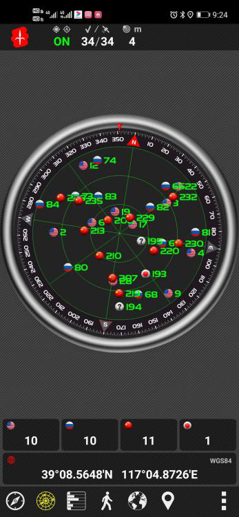
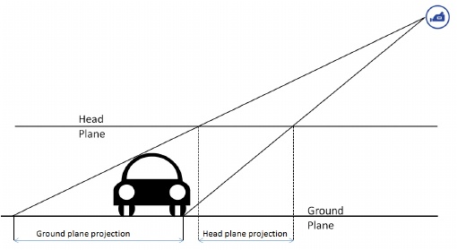
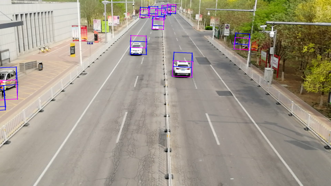

在交通视频中检测并追踪多目标车辆、对其进行定位、提取轨迹、进而获得其速度等信息在应用中具有非常重要的意义，因而一直是研究的热点。这一技术的应用场景非常丰富，包含但不限于交通违章抓拍，道路流量统计，车辆跟踪定位，园区安全监控、驾驶员行为分析等等。在这篇文章里，我想通过一个简单的项目来展示其中涉及的基本技术。这个项目是受到了 [Aubrey](https://github.com/AubreyC/trajectory-extractor) 的项目启发，Aubrey 的项目代码比较难读，但是不少想法值得借鉴。本文用到的知识并不复杂，只需要读者了解相机标定和 Kalman 滤波，并懂得如何使用 OpenCV。由于这并不是一个非常高明的实现，所以仅适合作为参考，大家也可以在其基础上开发验证更复杂的算法。代码维护在 [Github ](https://github.com/neozhaoliang/visual-vehicle-behavier-analyzer) 上。限于本人水平，代码和文章可能有不少不足和谬误之处，欢迎大家指正。

以下是效果视频，其中一个是直接在原视频中绘制轨迹和显示信息得到的；另一个是将得到的数据 csv 文件导入到 UE 搭建的虚拟仿真环境中得到的。

<video style="margin:0px auto;display:block" src="./simulation.mp4" width="600" controls></video>

视频中每个车辆的轨迹由一列点绘出，它们是车辆中心在地面上投影点的估计值。地面上标出的正北 (N)、正东 (E) 方向分别是世界坐标系下的 $x$ 轴和 $y$ 轴，地面是 $z=0$ 平面，$z$ 轴方向垂直向下。

这个项目有这么几个优点：

1. 非常容易复现，只需要一部手机和一台电脑即可。
2. 麻雀虽小五脏俱全，包含了标定、匹配、滤波、平滑的完整流程。
3. 代码可读性较好，且配有本文这样生动详尽的解释文档。

# 软硬件配置

项目使用的配置为：

1. 一部手机来拍摄视频并进行标定。
2. 运行环境 Python >= 3。
3. OpenCV>=3。
4. FFmpeg 用于生成效果视频。
5. [可选] OpenCV 包含 `dnn` 模块 。(用于运行 YOLOv3，使用 `tensorflow`，`pytorch` 等深度学习库，或者使用其它神经网络进行多目标检测也是可以的)

条件允许的话建议在编译 OpenCV 时开启 cuda ，并在 `main.py` 中指定 `use_gpu=True` 进行加速，当然这并不是必须的。

# 准备工作

## 拍摄视频并采集 GPS 数据

我使用的是一部华为荣耀 9 手机，在某天桥上拍摄了一段时长半分钟左右的视频，视频分辨率为 1920x1080，帧率 30 fps。拍摄时使用了三角架固定防止手持抖动造成的误差。

为了能在像素和地面坐标之间转换，我们还需要采集场景中地面上不少于四个标志点的 GPS 经纬度数据 (建议多采集几个)。这些标志点在视频中必须清楚可见，从而我们可以获得其对应的像素坐标。理想条件下可以使用高精度差分定位设备，其误差可以达到厘米级。在我们这个简易条件下可以使用手机软件 GPS Test 进行采集，只要打开软件，将手机放置在地面上待读数稳定以后将数据记录下来即可。下图是 GPS Test 软件采集数据的示意图：

这时得到的 GPS 数据精确到小数点后 6 位，其对应的误差范围是米级。

## 建立大地直角坐标系

在上一步采集的地面标志点中，任选其中一个作为原点 $O$，以 $O$ 的正北方向为 $x$ 轴正向，$O$ 的正东方向为 $y$ 轴正向，垂直地面向下为 $z$ 轴正向建立右手直角坐标系 $Oxyz$，规定地面为平面 $z=0$，并将其它标志点的经纬度坐标转换为此坐标系下的直角坐标。转换公式为
$$\begin{align*}x &= (P_{\text{lat}} - O_{\text{lat}})\cdot s,\\ y &=(P_{\text{lon}} - O_{\text{lon}})\cdot s\cdot\cos(O_{\text{lat}}\cdot\pi/180).\end{align*}$$
其中下标 lat, lon 分别表示该点的纬度和经度，$s = 111318.84502145034$ 是椭球因子。

你也可以使用 UTM 坐标系 (高斯－克吕格投影) 来转换经纬度，但是我怀疑这么简易的条件下使用那种复杂的公式效果未必更好。

从现在起我们固定取直角坐标系 $Oxyz$ 为世界坐标系，点 $P=(X,Y,Z)$ 的世界坐标即为 $P$ 在 $Oxyz$ 下的坐标。此外我们固定地面为世界坐标系下的 $z=0$ 平面。

# 相机内参与外参标定

为了能够将真实世界中点的坐标与其在视频中的像素坐标之间进行互相转换，我们需要获取如下信息：

1. 相机的内参，负责图像坐标系和相机坐标系之间的转换。它包含两个部分，一个是 $3 \times 3$ 的相机矩阵 $K$，另一个是 $1 \times 4$ 的畸变系数 $D$。

2. 相机的外参，负责相机坐标系和世界坐标系之间的转换。它包含一个$3 \times 3$ 的旋转矩阵 $R$ 和一个 $1 \times 3$ 的平移向量 $T$。

通常标定相机内参需要使用专门的标定板，并运行对应的标定程序，通过得到的内参再计算外参。我们这里偷懒一点，把整个过程一步搞定。为此我们就假定手机的前置相机符合理想的针孔相机模型 [^1] (这里我们选择信任华为手机的相机质量)，于是其畸变系数 $D=0$，并且图像中心位于相机主轴上，于是相机矩阵 $K$ 形如
$$K=\begin{pmatrix}f&0&w/2 \\0 &f& h/2 \\0&0&1\end{pmatrix}.$$
其中 $w,h$ 分别是图像的宽度和高度，是已知的；$f$ 是相机的焦距，是未知的。于是 $K$ 是关于 $f$ 的单参数函数，我们把 $K$ 写作 $K_{f}$ 来表示这个关系。这时我们可以通过采集的标志点及其对应像素计算一个 $f$ 的估计值得出 $K_f$ 来，再进一步得出 $R, T$。

回忆对理想针孔相机模型，其世界坐标 $P=(X,Y,Z)$ 与图像坐标 $p=(x,y)$ 之间的映射关系为

$$\begin{equation}s\begin{pmatrix}x\\y \\1\end{pmatrix} = K\left(R\begin{pmatrix}X \\Y \\Z\end{pmatrix}+T\right). \label{eq:pinhole}\end{equation}$$
其中 $s$ 是一个非零实数。由此我们可以得到从世界坐标系到图像坐标系的映射 $F$ 的表达式：

$$\begin{equation}\begin{pmatrix}x\\y\end{pmatrix} = F(P) = \frac{\begin{pmatrix}
a_{11}X + a_{12}Y + a_{13}Z + b_{1} \\
a_{21}X + a_{22}Y + a_{23}Z + b_{2}\end{pmatrix}}{(a_{31}X + a_{32}Y + a_{33}Z + b_{3})}. \label{eq:proj} \end{equation}$$

其中 $A = KR=(a_{ij})_{1 \leq i,j \leq 3}$，$B = KT = (b_{1},b_{2},b_{3})^{T}$。

从像素坐标 $p$ 反算世界坐标 $P$ 时，由于维度损失我们必须指定 $P$ 所在的平面 $Z=a$。令 $Z=a$ 并将 $\eqref{eq:pinhole}$ 式变换为

$$sR^{T}K^{- 1}\begin{pmatrix}x \\y \\1\end{pmatrix} = \begin{pmatrix}X \\Y \\a\end{pmatrix} + R^{T}T.$$
记 $C = R^{T}K^{- 1} = (c_{ij})_{1 \leq i,j \leq 3}$，$D = R^{T}T = (d_{1},d_{2},d_{3})^{T}$，比较上式两边的第三个分量得到
$$\begin{equation}s = \frac{a + d_{3}}{c_{31}x + c_{32}y + c_{33}}.\label{eq:sss}\end{equation}$$
再比较前两个分量我们就得到了世界坐标 $P$ 作为 $p$ 的函数的表达式
$$\begin{pmatrix}X \\Y\end{pmatrix} = F_{\rm inv}(p)=\begin{pmatrix}
sc_{11}x + sc_{12}y + s - d_{1} \\
sc_{21}x + sc_{22}y + s - d_{2}\end{pmatrix}.$$

有了以上预备知识，设 $\{P_{i} = (X_{i},Y_{i},0),1 \leq i \leq n\}$ 是采集的 $n$ 个标志点，它们在视频中对应的像素坐标为 $\{ p_{i} = (x_{i},y_{i}),1 \leq i \leq n\}$。对任何给定的 $K_{f}$，我们利用 OpenCV 的 `solvePnP` 函数和不少于四组标志点 $P_{i}$ 及其对应像素 $p_{i}$ 解出对应的旋转矩阵 $R_{f}$ 和平移向量 $T_{f}$，从而得到对应的映射 $F_{f}$。定义损失函数为将所有标志点 $P_{i}$ 利用 $F_{f}$
重投影后得到的像素与实际像素 $p_{i}$ 的均方误差之和
$${\rm err}(f)=\sum_{i = 1}^{n}\left\| F_f(P_{i}) - p_{i} \right\|^{2}.$$

我们的目的是求出在约束 $f > 0$ 条件下使得 ${\rm err}(f)$ 取值最小的 $f$ 的值。由于 ${\rm err}(f)$ 是关于焦距 $f$ 的非线性函数，而且是连续可微的，我们可以采用非线性最优化函数如序贯最小二乘规划 [^2] (SLSQP) 等进行求解。SLSQP 方法需要先设定一个 $f$ 的初值，然后它会根据 ${\rm err}(f)$ 梯度下降的方向迭代一定次数寻找损失函数的最小值。我们令使得 ${\rm err}(f)$ 取最小值的 $f_{\min}$ 为相机焦距估计值，由此得出 $K$ 的估计值，并再次利用 OpenCV 的 `solvePnP` 函数解出对应的旋转矩阵 $R$ 和平移向量 $T$。

在这个程序中，你需要在采集的视频中取出一帧图像，并将标志点在世界坐标系下的 GPS 坐标和它们在图像中的像素坐标按照顺序保存在 `scene_data/example_scene.yaml` 中，然后运行脚本 `camera_calibration.py` ，得到的效果如下图：

其中标志点对应的真实像素用黄点标出，把标志点根据估计的相机模型重投影得到的点用红点标出。此外还标出了标志点在世界坐标系下的 $xy$ 坐标。由图可见二者基本一一重合，因此我们对相机参数的估计是大致准确的。

{}
**注**：运行 `camera_calibration.py` 后点击回车，会将相机参数写入文件 `scene_data/camera_params.yaml` 中，点击 `q` 则会直接退出。如果红色和黄色点误差较大的话需要检查标志点的坐标和像素设置是否正确。
{}

# 多目标车辆检测与追踪

接下来的步骤是使用神经网络检测视频中的车辆，并将不同帧之间的检测结果关联起来形成稳定的追踪。这里使用的方法是经典的  SORT [^3] ，它分为多目标检测和多目标追踪两部分，并用二分图的极大匹配将二者联系起来。

我们首先使用 YOLOv3 对视频流进行逐帧检测，但是只保留和车辆有关的对象如轿车、卡车、客车、摩托车等。每一帧检测的结果是一个对象列表，每个对象包含如下属性： 

1. 对象在该帧中的 ID。(如 0, 1, 2, ...)
2. 对象的分类标签。(如小汽车/行人/卡车)
3. 对象的置信度。(0\~1 之间的浮点数)
4. 对象在该帧中所属的矩形区域的边框$\ (x_{1},y_{1},x_{2},y_{2})$，其中 $(x_{1},y_{1})$ 是边框左上角的像素坐标，$(x_{2},y_{2})$ 是边框右下角的像素坐标。

为了将不同帧中的对象关联起来，我们维护一个由不同轨迹 $\mathcal{T} = \{ T_{1},\ldots,T_{m}\}$ 组成的列表，其中每个轨迹 $T_{i} \in \mathcal{T}$ 来自视频中的一个车辆 (不能排除同一辆车生成多条轨迹的可能性)，$T_{i}$ 包含如下属性：

1. 该轨迹对应的车辆的分类。
2. 该轨迹在所有轨迹中的 ID。
3. 一个由边框组成的序列 $B_{k},\ldots,B_{k + l}$，其中 $k$ 是该车辆首次出现的帧的下标，$k + l$ 是该车辆最近一次出现的帧的下标。某些 $B_{i}$ 允许取值为 `null`，这表示该车辆在第 $i$ 帧中没有被检测到。
4. 一个 bool 值 `active`，它等于 `true` 表示该轨迹处于活跃状态 (车辆仍在视野内)，等于 `false` 表示该轨迹处于死亡状态 (车辆离开了视野)。记 $\mathcal{T}_{\text{active}}$ 为所有活跃轨迹组成的 $\mathcal{T}$ 的子集 。

假设当前帧的编号为 $t$，$X = \{ X_{1},\ldots,X_{n}\}$ 是第 $t$ 帧中检测到的车辆集合，其边界框分别为 ${\{ B}_{1},\ldots,B_{n}\}$，我们按照如下规则将 $X$ 与 $\mathcal{T}_{\text{active}}$ 中的轨迹进行匹配，并更新 $\mathcal{T}$ 和 $\mathcal{T}_{\text{active}}$：

**轨迹匹配规则**：

1. 取定一个正整数 $N$ 和一个 0\~1 之间的阈值 $\alpha$，比如 $N = 30$，$\alpha = 0.3$。
2. 设 $\mathcal{T}_{\text{active}} = \{ T_{1},\ldots,T_{M}\}$ 是所有活跃的轨迹，对每个 $k = 0,\ldots,N$，重复执行步骤 3。
3. 设 ${\{ C}_{1},\ldots,C_{M}\}$ 分别是 $\{ T_{1},\ldots,T_{M}\}$ 中的轨迹在时刻 $t - k$ 时刻的边框，定义二分图 $G$ 如下：$G$ 的顶点集为 ${\{ C}_{1},\ldots,C_{M}\} \cup {\{ B}_{1},\ldots,B_{n}\}$，其边形如 $e = (C_{p},B_{q})$，$e$ 的权值为两个矩形 $C_{p},B_{q}$ 的 `iou` 值 (intersection over union)：$$\text{weight}(e) = \text{iou}(C_{p},B_{q}) = \frac{|C_{p} \cap B_{q}|}{|C_{p} \cup B_{q}|}.$$
   其中集合 $|C_{p} \cap B_{q}|$ 和 $|C_{p} \cup B_{q}|$ 的大小为其各自包含的像素的个数。若 $C_{p}$ 值为 `null` 则规定 $\text{weight}(e)$ 为 0。利用匈牙利算法我们可以求得 $G$ 的一个极大匹配 $M$，若 ${(C}_{p},B_{q}) \in M$ 属于此匹配且 $\text{iou}(C_{p},B_{q}) \geq \alpha$ 则我们认为当前帧检测到的对象 $X_{q}$ 与轨迹 $T_{p}$ 匹配，并把 $X_{q}$ 更新到 $T_{p}$ 的边框列表中下标为 $t$ 处。

    注意一旦 $X_{q}$ 与 $T_{p}$ 匹配，在 $k$ 的下一次循环中我们就不再考虑它俩。
   
4. 在步骤 2 的循环结束后，若某个对象 $X_{q}$ 没有与任何活跃轨迹匹配，则认为 $X_{q}$ 是这一帧中新出现的车辆，为其分配一个新的轨迹并将其加入活跃的轨迹列表 $\mathcal{T}_{\text{active}}$ 中。
5. 最后检查 $\mathcal{T}_{\text{active}}$ 中的所有轨迹，若其已经有超过 $N$ 帧没有更新，则判断其死亡，将其 `active` 属性置为 `false` 并移出集合 $\mathcal{T}_{\text{active}}$。

这个匹配规则可以简单概括为，如果一个新检测到的车辆没有和上一帧中的任何车辆匹配上，我们先不急于判定它是新出现的，而是继续将其与某个更久远的范围内的历史记录进行匹配，直到匹配全部失败才为其分配新的 ID；同理如果一个轨迹没有与当前帧的任何车辆匹配上，我们也不急于判定它死亡，而是继续观察它一段时间，直到始终没有更新才将其判定为死亡并移出活跃列表。这样可以在一定程度上避免由于神经网络误检导致车辆时隐时现而分配多余的轨迹。

在 Aubrey 的代码中，由于神经网络的权重文件是在 `coco` 数据集上训练的，其误检率较高，所以他还加入了一层视觉特征追踪 (如 `CSRT`) 对上一步里 SORT 方法得到的轨迹进行二次合并，这确实可以有效减少冗余轨迹的数量。这个项目里也借鉴了这一点。

# 车辆世界坐标定位与轨迹优化

设 $T$ 是一段轨迹，它记录了一个车辆在某个时间范围内在视频中的位置信息，我们下面用这个信息结合相机模型来将其转换为车辆在世界坐标系下的坐标，并通过车辆动力学模型和 Kalman 滤波给出其优化的轨迹。

## 车辆世界坐标的计算

根据相机标定的结果，我们已经有了将视频中的像素转换为其对应的世界坐标系下 $Z = a$ 平面上的点的表达式 $F_{\text{inv}}$。设 $B_{t}$ 是轨迹 $T$ 在时刻 $t$ 记录的边框，我们要在矩形区域 $B_{t}$ 的内部选择一个像素 $p$，用 $F_{\text{inv}}$ 将其投影到某个合适的 $Z = a$ 平面上，用得到的 $(X,Y)$ 作为车辆在地面上的坐标。$p$ 可以取为 $B_{t}$ 的中心或者底边的中点，两种选择都是可以的，但是最好不要直接把 $p$ 映射到地面对应的 $Z = 0$ 平面上，这是因为根据相机透视原理，如果 $p$ 取为 $B_{t}$ 的中心，则投影后的坐标会比真实值要远；如果 $p$ 取为底边的中点，则投影后的坐标会比真实值要近，如下图所示：

为此我们利用一点先验知识：现实中小汽车的高度一般在 1.6 米左右，客车和卡车的高度在 2 米左右，所以我们取 $p$ 为 $B_{t}$ 的中心，根据车辆类型将其映射到平面 $Z=-1.6$ 或者 $Z=-2$ 上，这样投影的误差要小于投影到地面 $Z = 0$ 平面上。注意由于 $Z$ 轴正向指向地面所以地面上方的高度是负值。

对轨迹 $T$ 的边框列表中的每一个非 `null` 值的边框都这样投影，我们就得到了 $T$ 对应的车辆的一列世界坐标系下的轨迹点，这列点在时间上未必连续，在空间上由于相机标定、坐标解算、神经网络边框计算等误差的积累，散布范围也比较大，我们下面用 Kalman 滤波对其进行优化。

## Kalman 滤波与轨迹优化

Kalman 滤波的直观想法是，对于运动中的车辆，我们把根据其运动学方程推算的理论值，和视觉的观测值进行加权平均，权重系数与理论值和观测值各自的方差倒数成正比，方差大的由于不确定性大所以权重小，方差小的说明精度高所以权重大。这样得到的融合后的估计具有均方误差最优性质。

Kalman 滤波需要事先给出车辆的运动学模型和观测模型，动力学模型我们选择自行车模型 [^4]，它把车辆前轮和后轮分别看作一个整体，从而等效为一辆自行车。这个模型状态向量为 $\mathbf{x} = {(x,y,v,\varphi,\beta)}^{T}$，其中 $x,y$ 是车辆质心的地面坐标，$v$ 是车辆速度绝对值，$\varphi$ 是车辆速度的方向，$\beta$ 是前轮转角。它们之间满足

$$\begin{equation}
\begin{array}{l}
&\dot{x} = v\cos(\varphi + \beta) \\
&\dot{y} = v\sin(\varphi + \beta) \\
&\dot{v} = u_{1} \\
&\dot{\varphi} = v\sin(\beta)/l_{r} \\
&\dot{\beta} = u_{2} \\
\end{array}.
\label{eq:bm}
\end{equation}
$$
其中 $l_r$ 是车辆质心与后轴中心的距离，一般取作 $l_r = 2.0{\rm m}$。$u_1$ 是车辆加速度，$u_2$ 由车辆和方向盘转角决定。$u_1,u_2$ 都是驾驶员给出的控制量，我们无法直接观测到，所以都归入噪声的部分。

自行车模型是非线性模型，所以我们的滤波是扩展 Kalman 滤波 (extended Kalman filter)，其过程模型可以写作 ($\mathbf{w}$ 是服从高斯分布的噪声序列)

$$\dot{\mathbf{x}} = \mathbf{F}(\mathbf{x})+\mathbf{w}.$$

$\mathbf{F}$ 的雅可比矩阵 $\mathbf{J}_{\mathbf{F}}$ 为 (令
$\alpha = \varphi + \beta$)

$$\begin{pmatrix}
0 & 0 & \cos(\alpha) & - v\sin(\alpha) & - v\sin(\alpha) \\
0 & 0 & \sin(\alpha) & v\cos(\alpha) & v\cos(\alpha) \\
0 & 0 & 0 & 0 & 0 \\
0 & 0 & \sin(\beta)/l_{r} & 0 & v\cos(\beta)/l_{r} \\
0 & 0 & 0 & 0 & 0 \\
\end{pmatrix}.$$

注意在离散化的时候需要给 $\mathbf{J}_{\mathbf{F}}$ 乘以帧之间的时间间隔 $\mathrm{d}t$。

Kalman 滤波的观测模型就是针孔相机模型 ($\mathbf{v}$ 也是服从高斯分布的噪声序列且与 $\mathbf{w}$ 独立)
$$\mathbf{z} = \mathbf{H}(\mathbf{x}) + \mathbf{v}.$$

其中映射 $\mathbf{H}$ 由把 $\eqref{eq:proj}$ 给出的映射 $F$ 作用在 $\mathbf{x}$ 的前两个分量上得到，其雅可比矩阵 $\mathbf{J}_{\mathbf{H}}$ 为

$$\mathbf{J}_{\mathbf{H}}=\frac{1}{s}\left(KRL-\begin{pmatrix}x\\y\\
1\\\end{pmatrix}\begin{bmatrix}0 & 0 & 1 \\\end{bmatrix}KRL \right).$$

其中 $s$ 按照 $\eqref{eq:sss}$ 进行计算，

$$L=\begin{pmatrix}
1 & 0 & 0 & 0 & 0 \\
0 & 1 & 0 & 0 & 0 \\
0 & 0 & 0 & 0 & 0 \\
\end{pmatrix}.$$

于是对当前每一条活跃的轨迹 ${T \in \mathcal{T}}_{\text{active}}$，我们令其初始状态 $\mathbf{x}$ 为零向量，将其边框列表的中心作为观察量代入[扩展 Kalman 滤波的迭代方程](https://en.wikipedia.org/wiki/Extended_Kalman_filter#Discrete-time_predict_and_update_equations)中得到一个优化后的轨迹。

# Rauch-Tung-Striebel 平滑

Kalman 滤波的优点是每次只依赖于上一时刻的估计值和当前时刻的观测值，其计算非常方便，完全可以做到实时性。但是它的缺点也很明显：Kalman 滤波给出的估计需要经过一段时间的迭代后才能收敛，其初始阶段的估计误差较大，而在一个交通场景视频中，许多车辆常常只出现几秒钟左右，并不足以保证滤波收敛。特别地，车辆在视频中出现的第一帧的速度值是 Kalman 滤波无法给出的。为了补救这一点，我们可以使用 Rauch-Tung-Striebel [^5] (RTS) 方法再做一次平滑。RTS 平滑的想法很简单：Kalman 滤波只使用上一次的估计值和当前的观察值来估计当前状态，但实际上由于车辆动力学的约束，车辆在后面时刻的状态也可以用来帮助改善当前时刻的估计 (想象一辆车从轨迹的末端开始向轨迹起点倒着开回来)！概括地讲，Kalman 滤波是基于整个过去观测值的线性最小方差估计，而 RTS 滤波则是包含了整个过去和一部分未来观测值的线性最小方差估计。RTS 平滑分为固定点平滑、固定延时平滑、固定区间平滑三种，我们这里采用的是第三种，对车辆的整个轨迹区间进行平滑。

下图显示的是只进行 Kalman 滤波处理与 Kalamn +  RTS 平滑的效果对比：


    
    
    

可以看到左图中仅做 Kalman 滤波处理得到的轨迹中有许多弯弯扭扭的部分，与右图中平滑后的轨迹有明显的差别，所以事实证明 RTS 平滑的效果是杠杠的。

可能有些读者对 RTS 平滑有些陌生，其实它是一个和 Kalman 滤波同时代出现的古老技术 (Kalman 滤波于 1960 年提出， RTS 平滑出现于 1965 年)，并且有非常广泛的应用。比如侦察卫星在飞到敌人头顶拍照的时候，为了从图像中获取尺度信息就需要估计卫星在拍照时的位姿，而这就属于固定点平滑的情形，我们可以把卫星在飞越敌人头顶之前和之后的状态合结合起来给出中间时刻卫星状态的估计。

限于篇幅，本文就不展开介绍 Kalman 滤波和 RTS 平滑的详细原理了，从数学的角度看它们不过是对随机变量空间的正交投影 (条件期望)，但是据我观察许多开发者限于专业背景在理解二者上还是有困难。我查了一下网上的资料，找到一篇我觉得把直观理解与严格推导结合的比较好的文章：["Kalman filter demystified: from intuition to probabilistic graphical model to real case in financial markets"](https://arxiv.org/abs/1811.11618)，推荐大家阅读。特别需要提醒的是，网上 (比如知乎) 那些宣称 "一文带你读懂 Kalman 滤波"、"十分钟搞懂什么是 Kalman 滤波" 之类的文章没有多少营养，要真想搞懂滤波，还是老老实实啃教材。上面推荐的文章虽然花了很多笔墨在直观解释 Kalman 滤波上，但是里面的证明部分还是有点硬核的。

# 其它信息分析与提取

## 驾驶员行为分析与统计信息提取

以下是我的设想，并没有在项目中实现：

在获得了对车辆状态向量 $\mathbf{x}$ 的平滑估计后，我们可以使用 $\eqref{eq:bm}$ 式通过求差分得出对驾驶员控制量 $u_{1},u_{2}$ 的估计值。由此可以进一步用统计方法，通过提取这一路段大量视频所包含的数据，分析驾驶员在这一地段容易采取的危险驾驶行为。比如我们可以计算并统计 $u_{1},u_{2}$ 变化率较大的区域，由此得出道路设计可能存在的隐患。

## 车辆 3D 位姿估计

我们还可以对车辆在世界坐标系下的 3D 位置尝试进行估计，方法如下：设 $P = (X,Y,0)$ 是车辆质心在地面上坐标的估计值，考虑以 $P$ 为中心的宽度为 2 米，长度为 4.5 米，高度为 1.6 米的长方体 $A$，真实车辆的大小应该整体基本位于 $A$ 中。我们要估计的是 $A$ 的摆放方向，即 $A$ 的中心与 $A$ 的宽高面的中心连线与正北方向的夹角 $\theta$。为此定义损失函数
$$l(\theta) = \lambda\cdot |F(A) - B| + (1-\lambda)\cdot |B - F(A)|.$$
其中 $\lambda$ 是一个选定的 $[0,1]$ 之间的系数，$F$ 是世界坐标系到图像坐标系的投影，$F(A)$ 是将 $A$ 投影到图像后在图像上所占据的像素区域之集，$B$ 是该车辆由神经网络检测得到的矩形边框，$|F(A) - B|$ 是位于 $F(A)$ 中但是位于矩形 $B$ 之外的像素的个数，$|B - F(A)|$ 是位于 $B$ 中但是位于 $F(A)$ 之外的像素的个数。$l(\theta)$ 是关于夹角 $\theta$ 的非线性函数，因此我们可以通过求解这个最优化问题来得到使得 $l(\theta)$ 最小的 $\theta$ 的值，以此作为 3D 长方体 $A$ 的方向。注意 $\lambda$ 的选择依赖于相机模型给出的 $F(A)$ 和 YOLOv3 给出的 $B$ 哪一个更准确。根据我的测试，YOLOv3 给出的边框 $B$ 误差较大，因此 $|B-F(A)|$ 的权重相应也较大 (因为我们要最小化这个损失函数)。代码中采用的是 $\lambda=0.2$。

比如对视频中一帧的车辆的 3D 位置估计如下图：

可以看到效果还是大致准确的。但是这个方法在 CPU 里面计算很慢，不太适合逐帧检测。此外有可能对某些车辆其最优化损失函数并不收敛，导致估计的 3D 边框误差非常大。

# 关于代码

如果你想针对自己拍摄的场景来运行项目代码的话，需要按照以下步骤来做：

1. 采集世界坐标系的 GPS 坐标点，拍摄视频，将 GPS 坐标数据与对应的像素位置放在 `scene_data/example_scene.yaml` 中。
2. 运行 `camera_calibration.py`，确认弹出的画面中红点和黄点基本重合后点回车完成相机标定，并在随后弹出的画面中点击选择监控区域。位于监控区域之外的车辆将不会被列入最终的轨迹列表。
3. 下载 YOLOv3 的权重文件 [`yolov3.weights`](https://pjreddie.com/darknet/yolo/) 并放在 `yolov3_coco` 目录下。
4. 运行 `main.py` 获得结果。结果包含一个效果视频 (如本文开头视频) 和一个 csv 文件，csv 文件中包含了每个轨迹的车辆类型，在每一帧中的坐标、速度、方向数据。
5. 项目中还有一个脚本 `estimate_3dbox.py`，用于演示估计车辆世界坐标系下的 3D 位姿。

初次运行时建议同名替换，不要修改默认的文件夹和参数文件名称，等熟悉了代码流程后再自由修改不迟。

[^1]: Hartley, R.~I. and Zisserman, A. "Multiple View Geometry in Computer Vision". Cambridge University Press. 2004.

[^2]: Dieter Kraft,  "A Software Package for Sequential Quadratic Programming", DFVLR-FB 88-28, 1988.

[^3]: Alex Bewley, Zongyuan Ge, Lionel Ott, Fabio Ramos, Ben Upcroft. "Simple Online and Realtime Tracking". arXiv:1602.00763.

[^4]: P. Polack, F. Altch, B. d' Andra-Novel, and A. de La Fortelle, "The kinematic bicycle model: A consistent model for planning feasible trajectories for autonomous vehicles". in 2017 IEEE Intelligent Vehicles Symposium (IV), pp. 812–818, June 2017.

[^5]: Rauch, H.E.; Tung, F.; Striebel, C. T. (August 1965). "Maximum likelihood estimates of linear dynamic systems". AIAA Journal. 3(8): 1445–1450.
